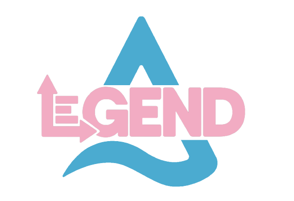
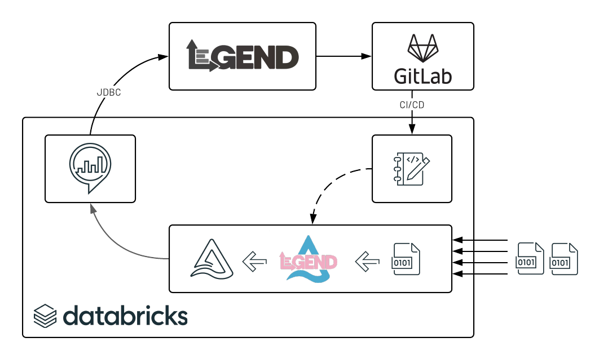
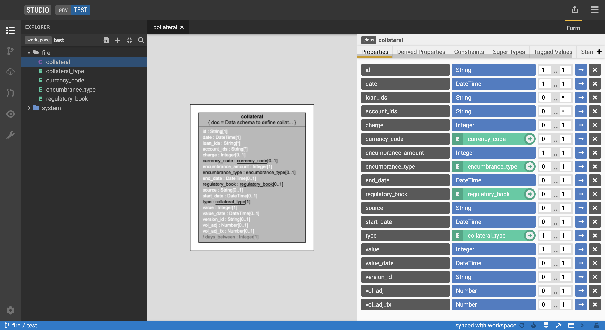
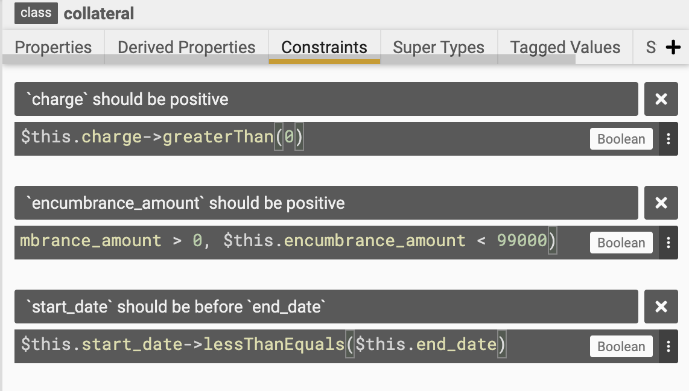

[](https://finosfoundation.atlassian.net/wiki/display/FINOS/Incubating)

# legend-delta



Part of the FINOS open source foundation, the [Legend](https://legend.finos.org/) framework is a flexible platform that 
offers solutions to explore, define, connect, and integrate data into your business processes. The Legend language is 
an immutable functional language based on the Unified Modeling Language (UML) and inspired by Object Constraint Language (OCL). 
It provides an accelerated data modeling experience that enables execution of model queries in various environments.

Part of the Linux foundation, [Delta Lake](https://delta.io/) is an open source storage layer that brings reliability to data lakes. 
Delta Lake provides ACID transactions, scalable metadata handling, and unifies streaming and batch data processing. 
Running on top of your existing data lake and fully compatible with the Apache Spark APIs, Delta brings the best of both 
data warehousing and data lakes functionalities into one unified platform.

By integrating the Legend Framework in a Lakehouse architecture, [Databricks](https://databricks.com/) and FINOS bring 
the best of open data standard and open source technologies together, improving data exchange across the financial services 
industry and supporting key organizations in their digital transformation. Today, we are pleased to release `legend-delta`, 
an open source component that acts as a conduit from domain expertise to automated data pipeline orchestration.

## Overview

In addition to the JDBC connectivity enabled to Delta Lake from the [legend-engine](https://github.com/finos/legend-engine) itself, 
this project helps organizations define data models that can be converted into efficient data pipelines, ensuring data being queried
is of high quality and availability. Raw data can be ingested as stream or batch and processed in line with the business semantics 
defined from the Legend interface.



Domain specific language defined in Legend Studio can be interpreted as a series of Spark SQL operations, 
helping analysts create Delta table that not only guarantees schema definition but also complies 
with expectations, derivations and constraints defined by business analysts. 



## Usage

Make sure to have the jar file of `legend-delta` available in your classpath and a legend data model 
(version controlled on gitlab) previously synchronized on disk or packaged as jar and available in your classpath.
We show you below how to extract schema, retrieve and enforce expectations.

### Retrieve legend entities

Legend project can be loaded by specifying a parent directory where `entities/${namespace}/${model.pure}` 
model definitions can be found. We load legend namespaces from a classpath or disk as follows

```scala
val legend = LegendClasspathLoader.loadResources("datamodel")
```

```scala
import org.finos.legend.spark.LegendFileLoader
val legend = LegendFileLoader.loadResources(("/path/to/legend/datamodel"))
```

All legend entities available will be retrieved and can be listed as follows, 
expressed in the form of `namespace::entity` and referencable as such.

```scala
legend.getEntityNames.foreach(println)
```

```
databricks::employee
databricks::person
```

### Convert pure to delta format

With our legend entities loaded, we can create the Delta schema for any entity of type `Class`. 
This process will recursively loop through each of its underlying fields, enums and possibly nested properties and supertypes.

```scala
val schema = legend.getEntitySchema("databricks::employee")
schema.fields.foreach(s => println(s.toDDL))
```

Note that we do not only find fields and their data types, but also retrieve Legend `TaggedValues` 
as business metadata (field description). One can simply create a delta table using the following `schema.toDDL` syntax.

```
`first_name` STRING NOT NULL COMMENT 'Person first name'
`last_name` STRING NOT NULL COMMENT 'Person last name'
`birth_date` DATE NOT NULL COMMENT 'Person birth date'
`id` INT NOT NULL COMMENT 'Unique identifier of a databricks employee'
`sme` STRING NOT NULL COMMENT 'Programming skill that person truly masters'
`joined_date` DATE NOT NULL COMMENT 'When did that person join Databricks'
`high_fives` INT NOT NULL COMMENT 'How many high fives did that person get'
```

Data can be schematized "on-the-fly" when reading raw records (see below an example reading JSON files).
Although JSON usually looks structured, imposing schema would guarantee missing fields are still expected
and data types fully enforced (e.g. a date object will be processed as a `java.sql.Date` instead of string)

```scala
val schematized = spark
  .read
  .format("csv")
  .schema(schema)
  .load("/path/to/data/csv")
```

### Retrieve expectations

Inferring the schema is one thing, enforcing its constraints is another. Given the `multiplicity` properties, we can 
detect if a field is optional or not or list has the right number of elements. Given an `enumeration`, 
we check for value consistency. These will be considered **technical expectations**.

In addition to the rules derived from the schema itself, we also support the conversion of business specific constraints
from the PURE language to SQL expressions. See below an example of **business expectations** as defined in the legend 
studio interface.



In order to convert PURE constraints into spark SQL equivalent, we need to indicate our framework
the strategy to convert legend entities into relational table. By specifying both a mapping and a runtime (of type Databricks), 
we leverage the legend-engine framework to generate an execution plan compatible with a Spark backend.


```scala
val expectations = legend.getExpectations(
  entityName = "databricks::employee",
  mappingName = "databricks::lakehouse::mapping"
)
expectations.foreach(println)
```

As reported below, we could derive the pure representation and SQL equivalent for both technical and
business constraints.

```
Expectation([first_name] is mandatory,$this.first_name->isNotEmpty(),firstname IS NOT NULL)
Expectation([last_name] is mandatory,$this.last_name->isNotEmpty(),lastname IS NOT NULL)
Expectation([birth_date] is mandatory,$this.birth_date->isNotEmpty(),birthdate IS NOT NULL)
Expectation([id] is mandatory,$this.id->isNotEmpty(),id IS NOT NULL)
Expectation([sme] is mandatory,$this.sme->isNotEmpty(),sme IS NOT NULL)
Expectation([joined_date] is mandatory,$this.joined_date->isNotEmpty(),joineddate IS NOT NULL)
Expectation([high_fives] is mandatory,$this.high_fives->isNotEmpty(),highfives IS NOT NULL)
Expectation([high five] should be positive,$this.high_fives > 0,highfives > 0)
Expectation([age] should be > 20,$this.joined_date->dateDiff($this.birth_date,DurationUnit.YEARS) > 20,year(joineddate) - year(birthdate) > 20)
```

We can validate all expectations at once on a given dataframe using a Legend implicit class, resulting in the same 
data enriched with an additional column. This column (column name can be specified) contains the name of any breaching 
constraints. Hence, an empty array consists in a fully validated record 

```scala
val validated = df.legendExpectations(expectations)
```

In the example above, we simply explode our dataframe to easily access each and every failed expectation, 
being schema specific or business defined.

```
+----------+---------+----------+---+------+----------+---------+--------------------+
| firstname| lastname| birthdate| id|   sme|joineddate|highfives|              legend|
+----------+---------+----------+---+------+----------+---------+--------------------+
|    Anthia|     Duck|1998-02-08| 10|Python|2015-01-14|      277|[age] should be > 20|
|    Chrysa|  Mendoza|1999-03-19| 18|     R|2019-06-06|      195|[age] should be > 20|
|   Sanders|   Dandie|1999-07-10| 20| Scala|2019-07-31|       77|[age] should be > 20|
|   Yanaton|  Schultz|1999-04-16| 27|Python|2016-07-30|      261|[age] should be > 20|
+----------+---------+----------+---+------+----------+---------+--------------------+
```

### Transform strategy

For convenience, we wrapped all of the above in a one function that indicates the input schema, transformations required
and both technical and business expectations required to store clean data to a target table. All this information is wrapped 
within a `LegendRelationalStrategy` object as follows

```scala
val legend = LegendClasspathLoader.loadResources("model")

val legendStrategy = legend.buildStrategy(
  "databricks::employee",
  "databricks::lakehouse::emp2delta"
)

val inputDF = spark.read.format("csv").schema(legendStrategy.schema).load("/path/to/csv")
val mappedDF = inputDF.legendTransform(legendStrategy.transformations)
val cleanedDF = mappedDF.legendValidate(legendStrategy.expectations, "legend")
cleanedDF.write.saveAsTable(legendStrategy.targetTable)
```

## Installation

```
mvn clean install [-P shaded]
```

To create an uber jar that also includes all required legend dependencies, use the `-Pshaded` maven profile

## Dependencies

The entire project depends on latest changes from legend-engine, legend-sdlc and legend-pure that supports 
Databricks data source. Until that code is merged to master, one would need to bring those changes and compile code locally.
Please refer to [scripts](scripts/legend-install.sh) for more information.

## Author

Databricks, Inc.

## License

Copyright 2021 Databricks, Inc.

Distributed under the [Apache License, Version 2.0](http://www.apache.org/licenses/LICENSE-2.0).

SPDX-License-Identifier: [Apache-2.0](https://spdx.org/licenses/Apache-2.0)
